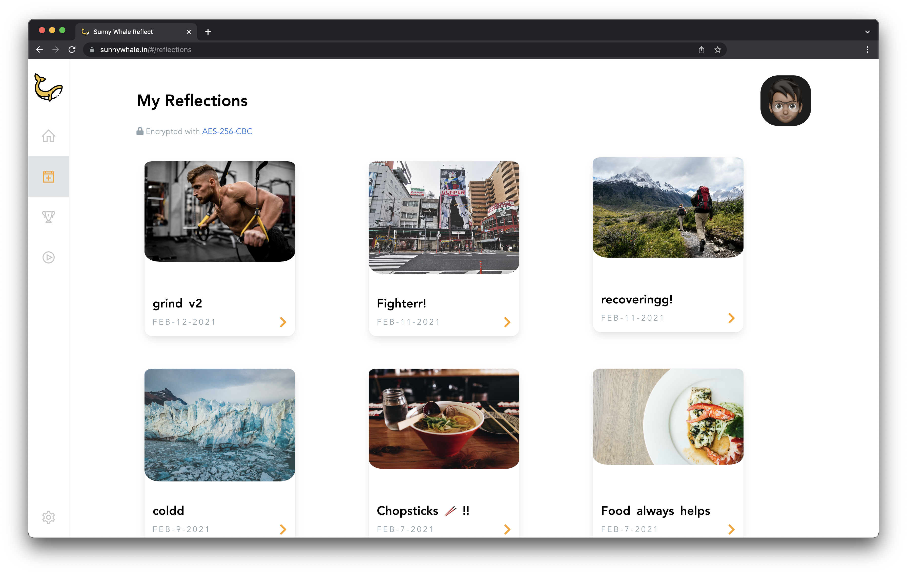
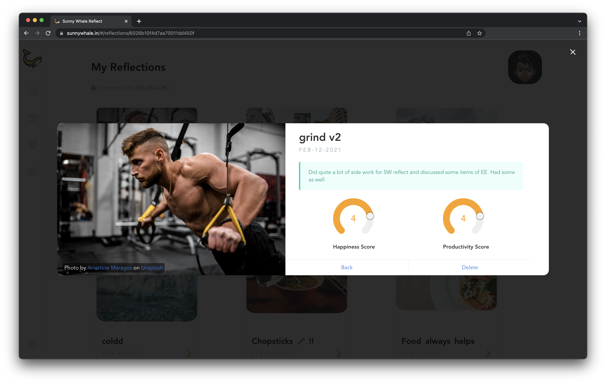
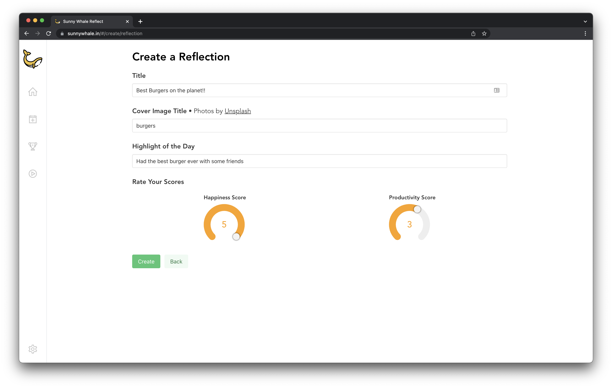
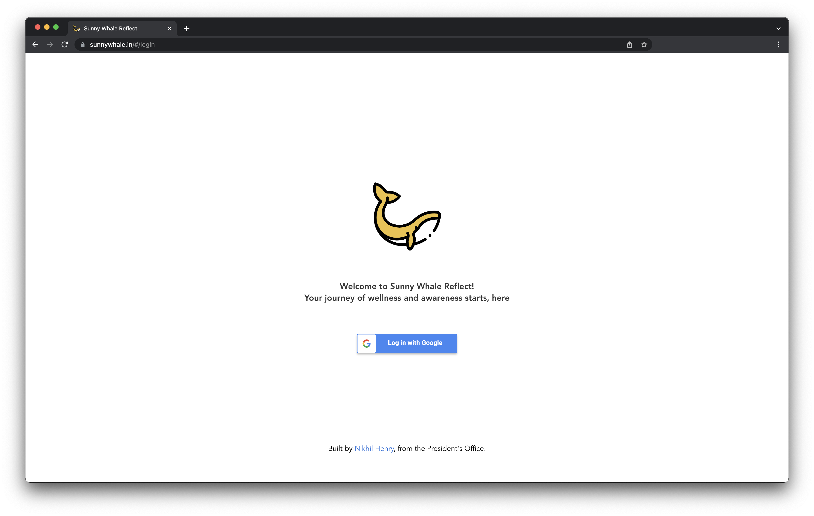
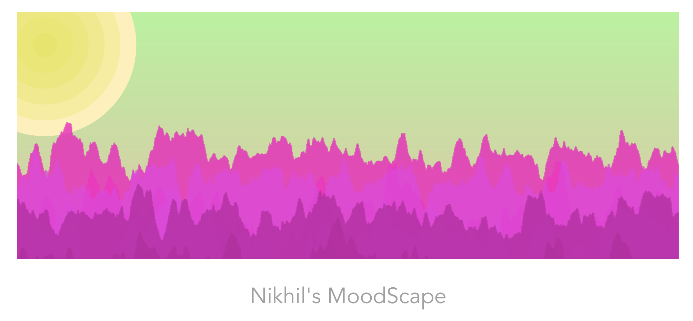

<ProjectLinks source={frontmatter.source} live={frontmatter.live}></ProjectLinks>

## About

A mood campinion app to boost mental awareness and well-being. Fullstack web application for both desktop and mobile. 
Launched as part of the *mental awareness week* campaign during my presidential term in my junior year of highschool.

## Stack
- [Express](https://expressjs.com/) backend 
- [MongoDB Atlas](https://cloud.mongodb.com/v2/5ea9386c468f9c5f315a6535#metrics/replicaSet/5ec2597012bfec1f1f998f60/explorer) (DaaS)
- [Mongoose](https://mongoosejs.com/) Schema & Driver connector
- [Vue.js V2](https://vuejs.org/) Client SPA
- [JWT](jwt.io) for auth
- [Heroku](https://dashboard.heroku.com/apps/carenikhil) for PaaS
- [Github](https://github.com/Sunny-Whale/reflect) CI/CD

## Features

### Daily Reflections and Moments
Jot down the highlights of your day and track your overall productivity and happiness along with a cover image
to visually summarise the day. 

### Unsplash API
Production ready and approved Unsplash API integration for cover images, powered by a text search.

### Google OAuth Login
Seamless integration with Google OAuth using access and refresh tokens to authenticate and authorize users on the platform.

### Moodscape
A visual representation of the user's past week compiled by number of reflection, moments and overall productivity and happiness scores for the week. Inspired by music scapes for Spotify.

